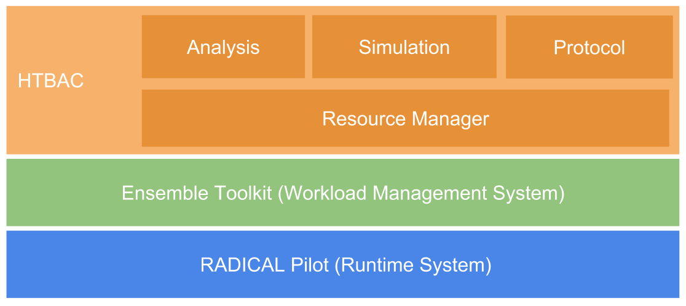

.. _introduction:

************
Introduction
************

Overview
========

HTBAC is a Python framework for developing and executing 
binding free energy applications comprised of multiple sets of replicas, aka ensemble members. 
The user can design a customized protocol consisting of a single or multiple
steps of simulations and/or analysis. Alternatively, the user can select a pre-defined protocol. HTBAC supports relative free energy, absolute free energy and ESMACS protocols. 
HTBAC is part of the the Radical-Cybertools stack. HTBAC uses The Ensemble Toolkit (ensemble 
management system) and RADICAL-Pilot (runtime system).  

HTBAC has the following features: (i) enable the scalable execution of concurrent 
free energy protocols, (ii) abstract protocol specification from execution and resource 
management, (iii) provide the ability to adapt protocols during runtime (iv) provide a well-established runtime capabilities to enable efficient and dynamic usage of grid resources and supercomputers, including NCSA Blue Waters, XSEDE, and ORNL Titan.

We will now discuss the high level design of HTBAC in order to 
understand how an application is created and executed.

Design
------

   `Figure 1: High level design of HTBAC`

HTBAC consists of several components that describe how to construct a free energy
protocol. The user builds an HTBAC application using 4 components: 
**Protocol**, **Simulation**, **System**, **Runner**. The **System** component 
defines the name of the physical system and the required files (coordinates, 
topology, etc.). The **Simulation** component allows users to define individual
simulation steps. Once simulation steps are defined, they can be added in 
a particular order to build the free energy protocol using the **Protocol** component. 

The **Runner** component aggregates protocols and accepts descriptions for the 
resource request, including CI, walltime, and queue. 

HTBAC uses The Ensemble Toolkit to manage protocols and resources. 
HTBAC also uses a runtime system execute protocols  
on computing infrastructures (CIs). The runtime system is expected to manage 
the direct interactions with the various software and hardware layers of the 
CIs, including the heterogeneity amongst various CIs.

Dependencies
------------

HTBAC uses The Ensemble Toolkit and RADICAL Pilot.
`RADICAL Pilot (RP) <http://radicalpilot.readthedocs.org>`_ 
serves as the runtime system. RP is targeted currently only for a set of high 
performance computing (HPC) systems 
(`see here <http://radicalpilot.readthedocs.io/en/latest/resources.html#chapter-resources>`_). 
RP can be extended to support more HPC systems by contacting the developers of 
RP/EnTK or by the user themselves by following 
`this page <http://radicalpilot.readthedocs.io/en/latest/machconf.html#writing-a-custom-resource-configuration-file>`_.

The Ensemble Toolkit relies on RabbitMQ to support messaging capabilities 
between its various components. Read more about it `here <http://www.rabbitmq.com/>`_.

Some dependencies such as parmed, numpy and other Python libraries are installed
automatically with HTBAC. RabbitMQ, on the other hand, needs to be installed manually by the user.
Instructions for all are provided in :ref:`here <installation>`.

Examples on how to create an HTBAC application: 
-----------------------------------

`Jupyter Notebook <https://github.com/radical-cybertools/htbac/blob/master/examples/htbac.ipynb>`_

Supported CI and engines
==============

HTBAC has several CIs and engines readily available for users. Users can specify
individual resources or use a list of pre-specified resources and engines:

`List of resources and engines <https://github.com/radical-cybertools/htbac/blob/master/htbac/resources.yaml>`_ 

Intended users
==============

HTBAC is python based and requires familiarity with the python language. 

Our primary focus is to support bio-simulations and enable domain scientists to execute 
their applications at scale on various of CI. 

